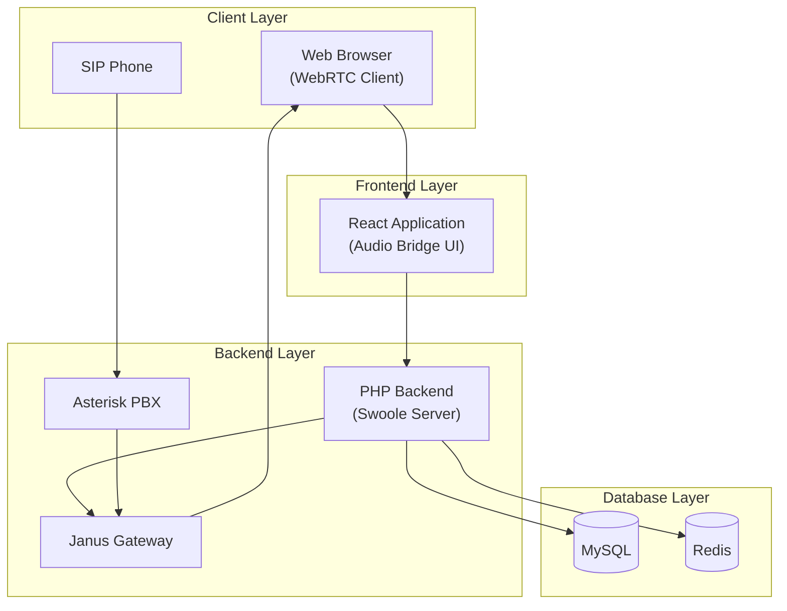

## System Architecture



## Framework Introduction

This project implements a WebRTC-SIP bridge that allows:

1. WebRTC clients to join audio rooms through a web browser
2. SIP clients (e.g., IP phones) to connect to WebRTC rooms
3. Bidirectional audio communication between WebRTC and SIP clients

The system consists of three main components:

1. Frontend (React + WebRTC)
2. Backend (PHP + Swoole)
3. Media Gateway (Janus Gateway + Asterisk PBX)

## Manual Deployment Guide

### 1. Prerequisites

- PHP 8.4.3 or higher
- Node.js 20.10.0
- MySQL 8.0
- Redis 6.0
- Asterisk PBX
- Janus Gateway
- pnpm package manager

### 2. Installing Janus Gateway

1. Install required dependencies:

```bash
sudo apt-get update
sudo apt-get install -y libmicrohttpd-dev libjansson-dev libssl-dev libsrtp2-dev libsofia-sip-ua-dev libglib2.0-dev libopus-dev libogg-dev libcurl4-openssl-dev liblua5.3-dev libconfig-dev pkg-config gengetopt libtool automake
```

2. Install libnice:

```bash
git clone https://gitlab.freedesktop.org/libnice/libnice
cd libnice
./autogen.sh
./configure --prefix=/usr
make && sudo make install
```

3. Install Janus Gateway:

```bash
git clone https://github.com/meetecho/janus-gateway.git
cd janus-gateway
sh autogen.sh
./configure --prefix=/opt/janus
make
sudo make install
sudo make configs
```

4. Configure Janus:
   - Copy the configuration files from the project:

```bash
sudo cp dockers/config/janus.jcfg /opt/janus/etc/janus/
sudo cp dockers/config/janus.plugin.audiobridge.jcfg /opt/janus/etc/janus/
sudo cp dockers/config/janus.plugin.sip.jcfg /opt/janus/etc/janus/
```

5. Start Janus:

```bash
/opt/janus/bin/janus
```

### 3. Installing Asterisk PBX

1. Install Asterisk:

```bash
sudo apt-get install -y asterisk
```

2. Configure Asterisk:
   - Copy the configuration files from the project:

```bash
sudo cp dockers/config/asterisk/sip.conf /etc/asterisk/
sudo cp dockers/config/asterisk/extensions.conf /etc/asterisk/
```

3. Restart Asterisk:

```bash
sudo systemctl restart asterisk
```

### 4. Backend Deployment

1. Install PHP extensions:

```bash
sudo pecl install swoole
sudo echo "extension=swoole.so" >> $(php -i | grep "Loaded Configuration File" | awk '{print $5}')
```

2. Install Composer dependencies:

```bash
composer install
```

3. Configure the environment:

```bash
cp config/.env.sample config/.env
```

Edit the `.env` file with your configuration:

```env
# Application settings
APP_ENV=production
APP_DEBUG=false
APP_KEY=your_secure_key

# Database settings
DB_CONNECTION=mysql
DB_HOST=127.0.0.1
DB_PORT=3306
DB_DATABASE=rtp_bridge
DB_USERNAME=your_username
DB_PASSWORD=your_password

# Janus settings
JANUS_HTTP_ENDPOINT=http://127.0.0.1:8088/janus
JANUS_API_SECRET=janusrocks

# Asterisk settings
ASTERISK_HOST=127.0.0.1
ASTERISK_PORT=5038
ASTERISK_USERNAME=admin
ASTERISK_SECRET=your_secret
```

4. Run database migrations:

```bash
php database/migrate.php
```

5. Start the backend service:

```bash
php src/index.php
```

### 5. Frontend Deployment

1. Install Node.js 20.10.0:

```bash
curl -o- https://raw.githubusercontent.com/nvm-sh/nvm/v0.39.0/install.sh | bash
source ~/.bashrc
nvm install 20.10.0
nvm use 20.10.0
```

2. Install pnpm:

```bash
npm install -g pnpm
```

3. Deploy the frontend application:

```bash
cd sample/janus-audio-bridge
pnpm install
```

4. Configure the frontend:
   Create `.env.local` file:

```env
VITE_API_BASE_URL=http://your_backend_ip:9501
VITE_JANUS_SERVER_URL=http://your_janus_ip:8088/janus
```

5. Build and start the frontend:

```bash
pnpm build
pnpm preview
```

## Usage Guide

### WebRTC Client (Browser)

1. Open the web application in your browser
2. Navigate to the Audio Room page
3. Enter a room number and join
4. Grant microphone permissions when prompted
5. You can now communicate with other participants in the room

### SIP Client (IP Phone)

1. Configure your SIP phone with one of the extensions (e.g., 6001, 6002)
2. To join a WebRTC room:
   - Dial 9xxx (where xxx is the room number)
   - Example: To join room 123, dial 9123
3. You will be connected to the WebRTC room
4. You can now communicate with WebRTC participants

### Making Calls from Web Interface

1. Navigate to the SIP Call page
2. Enter the SIP extension (e.g., 6001)
3. Enter the room number you want to connect to
4. Click "Make Call"
5. The SIP phone will receive the call and be connected to the room

## Testing

1. WebRTC to WebRTC:

   - Open two browser tabs
   - Join the same room number
   - Test audio communication

2. SIP to WebRTC:

   - From a SIP phone, dial 9xxx (xxx = room number)
   - Join the same room from a browser
   - Test audio communication

3. WebRTC to SIP:
   - Join a room from the browser
   - Use the SIP Call page to call a SIP extension
   - Test audio communication

## Troubleshooting

1. SIP Connection Issues:

   - Check Asterisk logs: `tail -f /var/log/asterisk/messages`
   - Verify SIP registration: `asterisk -rx 'sip show peers'`
   - Test SIP connectivity: `asterisk -rx 'sip show registry'`

2. Janus Issues:

   - Check Janus logs: `tail -f /var/log/janus.log`
   - Verify WebSocket connection
   - Check SIP plugin status

3. WebRTC Issues:
   - Check browser console for errors
   - Verify microphone permissions
   - Check WebRTC stats in browser

## Notes

1. Default Ports:

   - Janus Gateway: 8088 (HTTP), 8089 (HTTPS), 8188 (Admin/Monitor)
   - Asterisk: 5060 (SIP), 5038 (AMI)
   - Backend: 9501 (HTTP), 9502 (WebSocket)
   - Frontend: 4173 (Production), 5173 (Development)

2. Security Considerations:

   - Configure firewall rules
   - Use HTTPS in production
   - Secure API endpoints
   - Implement proper authentication

3. Production Deployment:
   - Set up SSL certificates
   - Configure STUN/TURN servers
   - Enable logging rotation
   - Set up monitoring
   - Use load balancing if needed

## Inbound SIP Call Flow

### Overview

The system handles inbound SIP calls through a sophisticated integration between Asterisk PBX and Janus WebRTC Gateway. Here's the detailed flow:

1. **Call Reception**

   - Inbound calls are received by Asterisk PBX
   - Dial pattern: `9XXX` (e.g., 9123 connects to room 123)
   - Example: Dialing 9456 will connect to WebRTC room 456

2. **Call Processing in Asterisk**

   ```
   [default]
   exten => _9XXX,1,NoOp(Forwarding to Janus WebRTC room ${EXTEN:1})
   same => n,Set(ROOM_NUMBER=${EXTEN:1})
   same => n,Set(CALLERID(name)=SIP-${CALLERID(num)})
   same => n,Set(__SIPADDHEADER01=X-Room-Number: ${ROOM_NUMBER})
   same => n,Set(__SIPADDHEADER02=X-Janus-Room: ${ROOM_NUMBER})
   same => n,Dial(${JANUS_GATEWAY},30,b)
   ```

3. **Janus Integration**

   - Calls are forwarded to Janus Gateway
   - Room information is passed via SIP headers
   - Janus creates RTP bridge for audio streaming
   - WebRTC participants receive the audio stream

4. **Media Handling**
   - SIP audio: RTP/PCMA or PCMU
   - WebRTC audio: Opus codec
   - Automatic transcoding when needed
   - Bidirectional audio support

### Implementation Details

1. **Backend Components**

   - `JanusGateway`: Manages Janus WebRTC Gateway communication
   - `MediaManager`: Handles SDP negotiation and media setup
   - `AsteriskService`: Controls Asterisk through AMI
   - `PbxController`: Exposes PBX control API endpoints

2. **Frontend Components**

   - `JanusClient`: WebRTC connection management
   - `AudioRoom`: Room UI and participant management
   - `SipCall`: SIP call control interface
   - Real-time audio level monitoring

3. **API Endpoints**

   ```
   POST /api/pbx/call          # Initiate SIP call
   GET  /api/pbx/status/:ext   # Get call status
   GET  /api/pbx/channels      # List active channels
   ```

4. **WebSocket Events**

   - `room:joined`: Participant joined room
   - `room:left`: Participant left room
   - `call:connected`: SIP call connected
   - `call:ended`: SIP call terminated

5. **Configuration Files**

   - `janus.plugin.sip.jcfg`: Janus SIP plugin config
   - `sip.conf`: Asterisk SIP configuration
   - `extensions.conf`: Asterisk dialplan

6. **Security Measures**

   - SIP authentication required
   - WebRTC secure signaling
   - Room access control
   - Rate limiting on API endpoints

7. **Monitoring and Logging**
   - Call status tracking
   - Media quality metrics
   - Error logging and alerts
   - Performance monitoring

### Validation Steps

1. **SIP Call Testing**

   ```bash
   # Test inbound call
   sip-call -u 6001 -p password6001 -d 9123

   # Monitor Asterisk
   asterisk -rx 'sip show peers'
   asterisk -rx 'core show channels'
   ```

2. **WebRTC Testing**

   - Open web interface
   - Create/join room 123
   - Verify audio connection
   - Check participant list

3. **Integration Testing**

   - Make SIP call to room
   - Verify WebRTC participants receive audio
   - Test bidirectional communication
   - Monitor media quality

4. **Performance Validation**
   - Check CPU/memory usage
   - Monitor network bandwidth
   - Verify concurrent call handling
   - Test reconnection scenarios
