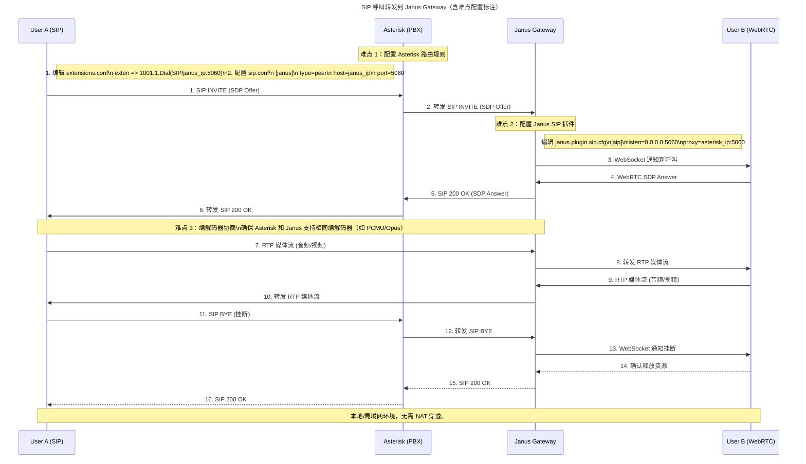

# 系统架构设计文档

## 1. 架构概述

### 1.1 当前架构

- 分层架构
- 主要组件：路由、中间件、控制器、服务、仓储
- 数据流向：Client -> Route -> Middleware -> Controller -> Service -> Repository -> DB

### 1.2 目标架构

- 领域驱动设计（DDD）
- 六边形架构
- CQRS 模式
- 事件驱动架构

## 2. 核心领域

### 2.1 用户领域

- 用户认证
- 权限管理
- 个人信息管理

### 2.2 订单领域

- 订单创建
- 订单状态管理
- 支付处理

### 2.3 产品领域

- 产品管理
- 库存管理
- 价格策略

## 3. 技术栈

### 3.1 核心框架

- PHP 8.4
- Swoole 4.8
- Composer 2.0

### 3.2 数据库

- MySQL 8.0
- Redis 6.0

### 3.3 消息队列

- RabbitMQ 3.8
- Kafka 2.8

## 4. WebSocket 架构

### 4.1 架构设计

- 独立进程运行
- 与API服务器共享配置和依赖
- 使用Swoole WebSocket服务器
- 支持多进程模式
- 父子进程通信机制
- 共享内存管理
- 连接池管理
- 消息广播机制
- 消息持久化支持
- 消息重试机制
- 连接负载均衡
- 消息压缩
- 消息优先级处理
- 消息签名验证

### 4.2 连接管理

- 最大连接数：1000
- 心跳检测机制
- 连接状态维护
- 断线重连处理
- 连接认证流程
- 连接超时处理
- 连接负载均衡
- 连接审计日志
- 连接速率限制
- IP访问控制
- 连接健康检查

### 4.3 消息处理

- 消息格式：JSON
- 消息类型：
  - 文本消息
  - 二进制消息
  - 控制消息
  - 订阅消息
  - 广播消息
  - 系统通知
  - 状态更新
  - 实时数据
- 消息路由机制
- 消息确认机制
- 消息重试机制
- 消息优先级处理
- 消息持久化
- 消息审计
- 消息追踪
- 消息压缩
- 消息加密

### 4.4 安全机制

- Token认证
- 消息加密
- 频率限制
- IP黑白名单
- 消息签名验证
- 连接速率限制
- 消息大小限制

### 4.5 性能优化

- 消息压缩
- 批量处理
- 连接复用
- 内存优化
- 异步处理

### 4.6 监控与日志

- 连接数监控
- 消息吞吐量监控
- 错误日志记录
- 性能日志记录
- 审计日志记录

## 5. 部署架构

### 5.1 开发环境

- Docker Compose
- 本地调试工具

### 5.2 生产环境

- Kubernetes 集群
- 自动伸缩
- 蓝绿部署

## 6. 监控与日志

### 6.1 监控系统

- Prometheus
- Grafana
- 告警系统

### 6.2 日志系统

- ELK Stack
- 日志分级
- 日志轮转

## 7. 安全设计

### 7.1 认证授权

- JWT 认证
- OAuth2 授权
- RBAC 权限控制

### 7.2 数据安全

- 数据加密
- 敏感信息脱敏
- 数据备份

## 8. 性能优化

### 8.1 缓存策略

- 本地缓存
- 分布式缓存
- 缓存失效策略

### 8.2 数据库优化

- 索引优化
- 分库分表
- 读写分离

## 9. 扩展性设计

### 9.1 微服务拆分

- 服务边界定义
- 服务通信协议
- 服务治理

### 9.2 插件机制

- 插件接口定义
- 插件生命周期
- 插件管理

## 10. 文档规范

### 10.1 API 文档

- OpenAPI 规范
- API 版本管理
- 文档自动生成

### 10.2 架构图

- C4 模型
- 时序图
- 数据流图

