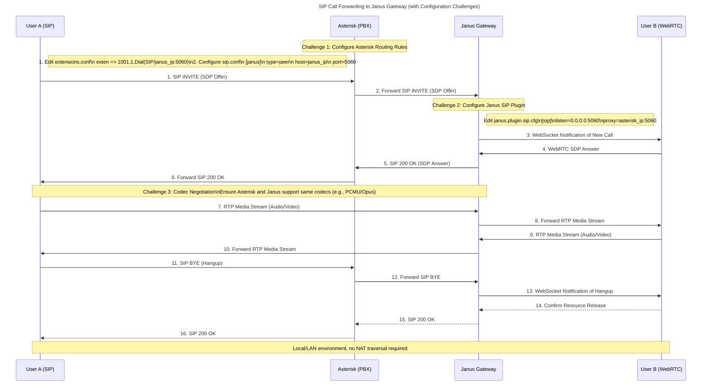

```mermaid
sequenceDiagram
    participant UserA as User A (SIP)
    participant Asterisk as Asterisk (PBX)
    participant Janus as Janus Gateway
    participant UserB as User B (WebRTC)

    title SIP Call Forwarding to Janus Gateway (with Configuration Challenges)

    %% ------------------ Challenge 1: Asterisk Routing Configuration ------------------
    Note over Asterisk: Challenge 1: Configure Asterisk Routing Rules
    Note left of Asterisk: 1. Edit extensions.conf\n   exten => 1001,1,Dial(SIP/janus_ip:5060)\n2. Configure sip.conf\n   [janus]\n   type=peer\n   host=janus_ip\n   port=5060

    UserA->>Asterisk: 1. SIP INVITE (SDP Offer)
    Asterisk->>Janus: 2. Forward SIP INVITE (SDP Offer)

    %% ------------------ Challenge 2: Janus SIP Plugin Configuration ------------------
    Note over Janus: Challenge 2: Configure Janus SIP Plugin
    Note right of Janus: Edit janus.plugin.sip.cfg\n[sip]\nlisten=0.0.0.0:5060\nproxy=asterisk_ip:5060

    Janus->>UserB: 3. WebSocket Notification of New Call
    UserB->>Janus: 4. WebRTC SDP Answer
    Janus->>Asterisk: 5. SIP 200 OK (SDP Answer)
    Asterisk->>UserA: 6. Forward SIP 200 OK

    %% ------------------ Challenge 3: Media Codec Negotiation ------------------
    Note over UserA, Janus: Challenge 3: Codec Negotiation\nEnsure Asterisk and Janus support same codecs (e.g., PCMU/Opus)
    UserA->>Janus: 7. RTP Media Stream (Audio/Video)
    Janus->>UserB: 8. Forward RTP Media Stream
    UserB->>Janus: 9. RTP Media Stream (Audio/Video)
    Janus->>UserA: 10. Forward RTP Media Stream

    %% ------------------ Call End ------------------
    UserA->>Asterisk: 11. SIP BYE (Hangup)
    Asterisk->>Janus: 12. Forward SIP BYE
    Janus->>UserB: 13. WebSocket Notification of Hangup
    UserB-->>Janus: 14. Confirm Resource Release
    Janus-->>Asterisk: 15. SIP 200 OK
    Asterisk-->>UserA: 16. SIP 200 OK

    %% ------------------ Environment Note ------------------
    Note over UserA, UserB: Local/LAN environment, no NAT traversal required.
```
